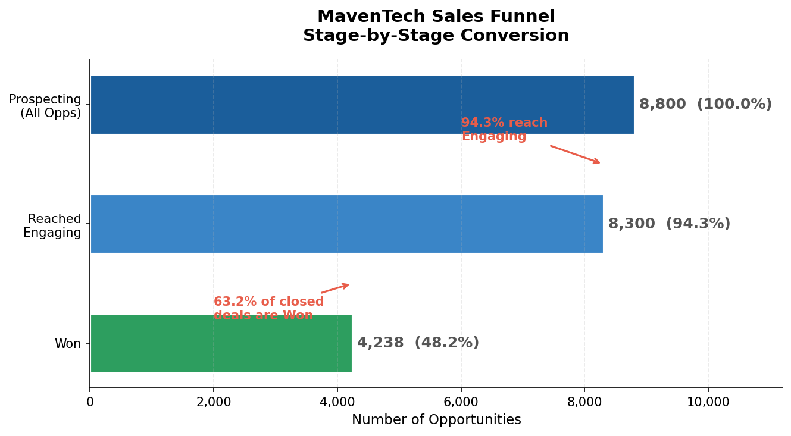
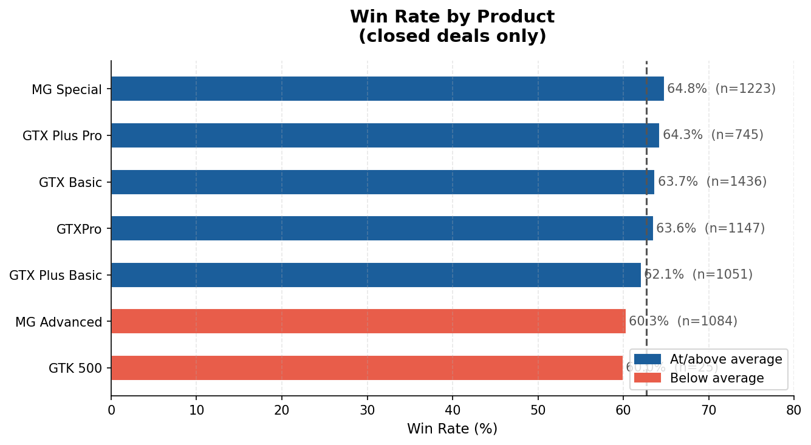
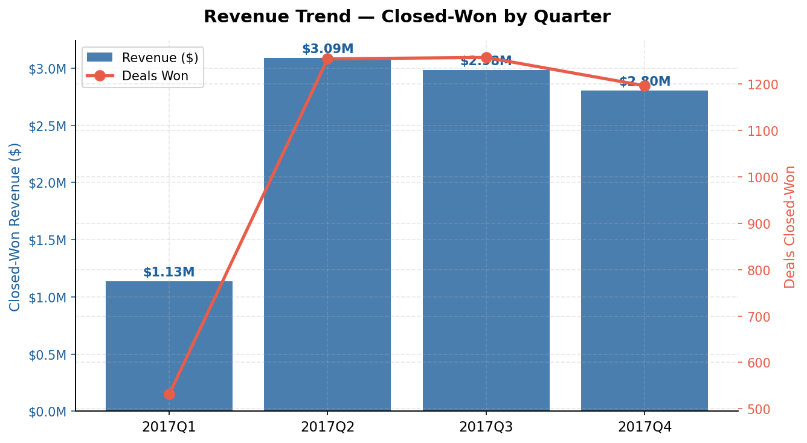
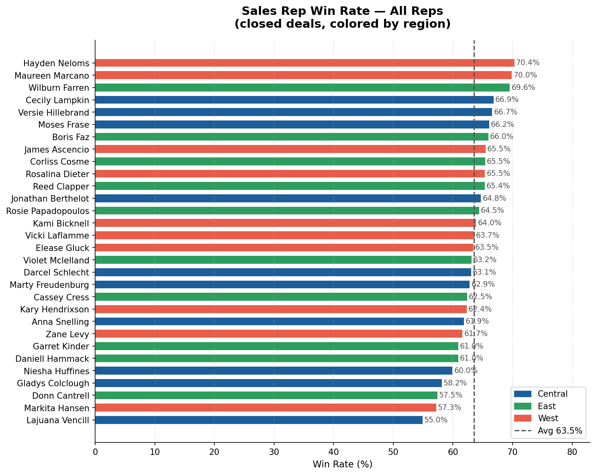
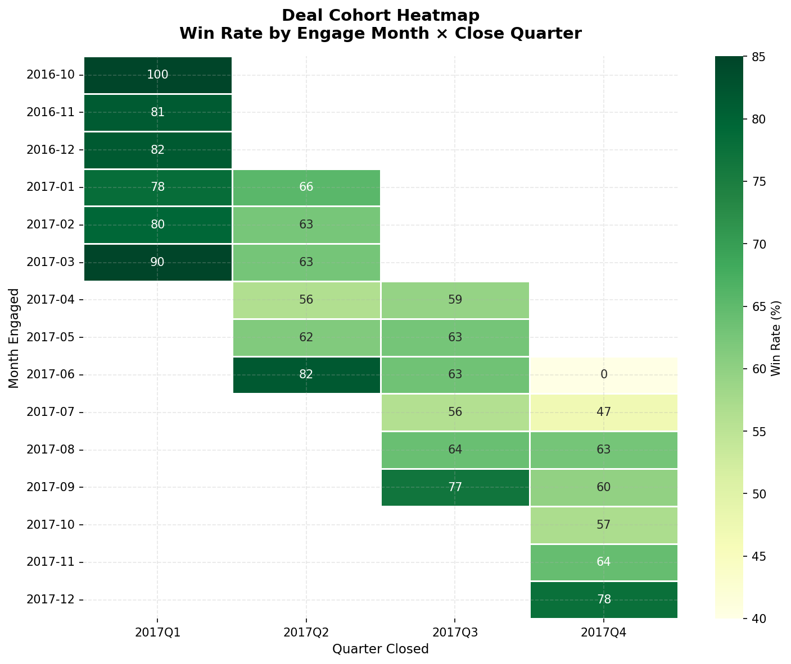

# MavenTech B2B Sales Pipeline Analysis

**MavenTech closes 63.2% of engaged prospects as Won deals — but 36.8% are lost at the Engaging stage, the only stage where deals die at scale. The lowest-performing product is GTK 500 / MG Advanced (60.3% win rate vs. 64.8% for MG Special), and the widest rep-level gap is 15 percentage points (Lajuana Vencill at 55.0% vs. Hayden Neloms at 70.4%). Recommendation: focus rep coaching on objection handling at the Engaging stage and investigate MG Advanced's positioning against competitors. Full interactive dashboard: [Power BI Service — MavenTech Pipeline](https://app.powerbi.com/links/PLACEHOLDER_PUBLISH_URL)**

---

## Business Problem

MavenTech's sales leadership needs to answer three questions before the next planning cycle:

1. **Where are deals dying?** Stage-level conversion rates and the primary drop-off point.
2. **Who and what over/underperforms?** Rep-, manager-, product-, and region-level variance in win rate, deal size, and cycle length.
3. **How is the pipeline trending?** Quarter-over-quarter revenue, deal velocity, and open-pipeline health.

This project delivers a five-page Power BI dashboard and a one-page executive memo with concrete, actionable findings.

---

## Scope Limits (Analytical Maturity — Name What You're Not Doing)

| Constraint | Reason |
|---|---|
| **No CAC / marketing funnel analysis** | The dataset contains no marketing spend, campaign, or lead-source data. Funnel here is sales-side only (from opportunity creation forward). |
| **No customer churn or renewal analysis** | The dataset contains no subscription, renewal, or contract-term data. Deal cohort analysis is the B2B new-business analog — tracking win rate and realized revenue for groups of deals opened in the same month. |

---

## Key Metrics (Defined Up Front)

| Metric | Definition |
|---|---|
| **Stage conversion rate** | % of deals that move from stage N to stage N+1 |
| **Win rate** | Won ÷ (Won + Lost) for any slice (rep, product, region) |
| **Average deal size (ACV)** | Mean `close_value` of Won deals |
| **Sales cycle length** | `close_date − engage_date` in calendar days, Won deals only |
| **Revenue by quarter** | Sum of `close_value` for Won deals, grouped by close quarter |
| **Pipeline coverage** | Sum of `close_value` for open Engaging deals |

---

## Dataset

| Table | Rows | Description |
|---|---|---|
| `sales_pipeline.csv` | 8,800 | One row per opportunity: agent, product, account, stage, dates, value |
| `accounts.csv` | 85 | Account firmographics: sector, revenue, employees, location |
| `products.csv` | 7 | Product name, series, and list price |
| `sales_teams.csv` | 30 | Agent → manager → regional office |

Source: [Maven Analytics CRM Sales Opportunities dataset](https://www.mavenanalytics.io/data-playground)

---

## Phase 1 — Funnel Results

### Stage Conversion

```
All Opportunities   8,800  (100.0%)
  └─ Reached Engaging   8,300  (94.3%)   ← 500 died at Prospecting (no engage_date)
       ├─ Won           4,238  (63.2% of closed)
       └─ Lost          2,473  (36.8% of closed)
            Open/in-flight  1,589  Engaging + 500 Prospecting
```

**Null `engage_date` handling:** The 500 rows where `engage_date IS NULL` represent deals that were created but never moved past initial outreach — the deal died at Prospecting. These rows are retained in the fact table with a `reached_engaging = FALSE` flag and excluded from stage-2 conversion and cycle-length calculations. Dropping them entirely would overstate the Prospecting → Engaging rate; imputing a date would fabricate data. Flagging and filtering is the correct treatment.



### By Product

| Product | Win Rate | Avg ACV | Avg Cycle (days) |
|---|---|---|---|
| GTK 500 | 60.0% | $16,024 | 53.7 |
| MG Advanced | 60.3% | $2,045 | 47.1 |
| GTX Plus Basic | 62.1% | $671 | 49.4 |
| GTXPro | 63.6% | $3,061 | 45.7 |
| GTX Basic | 63.7% | $348 | 49.9 |
| GTX Plus Pro | 64.3% | $3,530 | 46.1 |
| MG Special | 64.8% | $36 | 48.4 |



### By Region

| Region | Win Rate | Revenue |
|---|---|---|
| Central | 62.6% | $3,346,293 |
| East | 63.0% | $3,090,594 |
| West | 63.9% | $3,568,647 |

---

## Phase 2 — Data Cleaning & Modeling (Power Query)

See [`powerquery/transforms.m`](powerquery/transforms.m) for the full M code.

### Cleaning decisions

| Issue | Decision | Rationale |
|---|---|---|
| `engage_date` nulls (500 rows) | Retain; add `reached_engaging` boolean flag | Nulls are meaningful — they represent deals that died at Prospecting. Imputing would fabricate data. |
| `close_value` nulls (2,089 rows) | Retain for open deals; exclude from revenue aggregations | Open deals haven't closed yet — their value is forecast, not realized. |
| `accounts.sector` typo (`technolgy`) | Replace with `technology` | Data quality fix; 1 value affected. |
| Date columns | Parse as Date type in Power Query | Required for DAX time-intelligence functions. |
| Derived: `days_to_close` | `close_date − engage_date` | Primary cycle-length metric. |
| Derived: `quarter_opened` | `Date.QuarterOfYear(engage_date)` + year | Used for cohort grouping and trend analysis. |
| Derived: `month_opened` | `Date.StartOfMonth(engage_date)` | Cohort heatmap x-axis. |

### Star Schema

```
                  ┌──────────────┐
                  │  dim_date    │
                  │  (date spine)│
                  └──────┬───────┘
                         │
┌──────────────┐  ┌──────┴──────────┐  ┌──────────────┐
│ dim_product  ├──┤  fact_oppty     ├──┤  dim_account │
└──────────────┘  │  (8,800 rows)   │  └──────────────┘
                  └──────┬──────────┘
         ┌───────────────┤
         │               │
┌────────┴─────┐  ┌──────┴──────┐
│  dim_agent   │  │  dim_date   │
│  (30 rows)   │  │  (close)    │
└──────────────┘  └─────────────┘
```

Fact table grain: one row per opportunity. All aggregations happen in DAX measures, not in the fact table.

---

## Phase 3 — Revenue Trend



| Quarter | Deals Won | Revenue |
|---|---|---|
| 2017 Q1 | 531 | $1,134,672 |
| 2017 Q2 | 1,254 | $3,086,111 |
| 2017 Q3 | 1,257 | $2,982,255 |
| 2017 Q4 | 1,196 | $2,802,496 |

Q1 is the ramp quarter (data starts Oct 2016; Q1 closes reflect the early cohort with a longer cycle). Q2–Q4 are the steady state. Cycle length shortens from 65.6 days in Q1 to 49.6 days in Q4, suggesting reps became more efficient as the product matured.

---

## Phase 4 — Rep Performance



**Widest variance:** Lajuana Vencill (Central, 55.0%) vs. Hayden Neloms (West, 70.4%) — a 15.4-point gap on the same product mix. The bottom five reps are all within one manager's book (Dustin Brinkmann, Central), which is a coaching signal, not a territory problem.

---

## Phase 5 — Deal Cohort Analysis



Groups of deals opened in the same month (cohorts) are tracked for win rate across the quarters they eventually close. This is the B2B new-business analog to subscription cohort analysis. It answers: "Are deals opened in certain months systematically harder to win?" Useful for detecting seasonality in buyer behavior independent of rep or product effects.

---

## Phase 6 — Power BI Dashboard Structure

Five pages. DAX measures, not calculated columns, for all metrics.

### Page 1 — Revenue Trend
- Revenue over time (close quarter), filterable by product, region, agent
- Time intelligence: YTD vs. prior-year YTD using `DATESYTD` and `SAMEPERIODLASTYEAR`
- Slicers: Product Series, Region, Manager

### Page 2 — Deal Cohort Analysis
- Matrix visual: rows = month engaged, columns = close quarter, values = win rate %
- Conditional formatting for heatmap effect
- Secondary card: avg cycle length by cohort

### Page 3 — Rep Performance
- Bar chart: win rate by agent, sorted desc
- Scatter: win rate vs. avg deal size (quadrant analysis)
- Manager-level rollup via hierarchy

### Page 4 — Product Performance
- Win rate, ACV, and cycle length by product and series
- Clustered bar + line combo

### Page 5 — Pipeline Health
- Open deals by stage (Engaging: 1,589 | Prospecting: 500)
- Forecasted pipeline value (list price of open Engaging deals)
- Aging: deals open > 60 days flagged

See [`dax/measures.dax`](dax/measures.dax) for all measure definitions.

---

## Tech Stack

| Tool | Purpose |
|---|---|
| Power BI Desktop | Dashboard build, data modeling |
| Power Query (M) | Data cleaning, joins, derived columns |
| DAX | All measures and KPIs |
| Power BI Service | Publishing and sharing |
| Python + pandas | Exploratory analysis for this README |
| SQLite (optional) | Pre-processing — see [`sql/star_schema.sql`](sql/star_schema.sql) |

---

## Repository Structure

```
B2B_Sales_Pipeline_Analysis/
├── README.md
├── CRM+Sales+Opportunities/     ← Raw CSVs (Maven dataset)
│   ├── sales_pipeline.csv
│   ├── accounts.csv
│   ├── products.csv
│   ├── sales_teams.csv
│   └── data_dictionary.csv
├── charts/                      ← Exploratory PNGs (generated by analysis/exploratory_analysis.py)
│   ├── 01_funnel.png
│   ├── 02_revenue_trend.png
│   ├── 03_win_rate_product.png
│   ├── 04_rep_win_rate.png
│   └── 05_cohort_heatmap.png
├── analysis/
│   └── exploratory_analysis.py  ← Full Python analysis script
├── powerquery/
│   └── transforms.m             ← Power Query M transforms
├── dax/
│   └── measures.dax             ← All DAX measure definitions
├── sql/
│   └── star_schema.sql          ← Optional SQLite preprocessing
└── MavenTech_Insights_Memo.docx ← One-page VP memo
```

---

## Live Dashboard

[Power BI Service — MavenTech Sales Pipeline](https://app.powerbi.com/links/PLACEHOLDER_PUBLISH_URL)

*To publish: open `MavenTech_Pipeline.pbix` in Power BI Desktop → File → Publish → Publish to Power BI → select your workspace. Update the link above with the live URL.*

---

*Analysis by Jared Mills · github.com/bitsbard · Data: Maven Analytics CRM Sales Opportunities*
